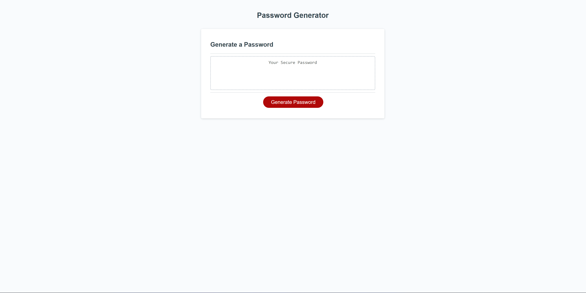
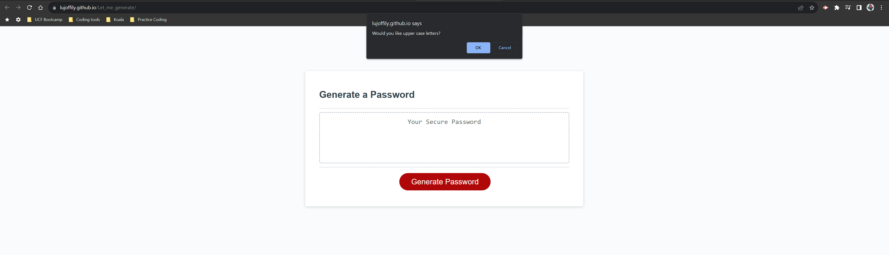
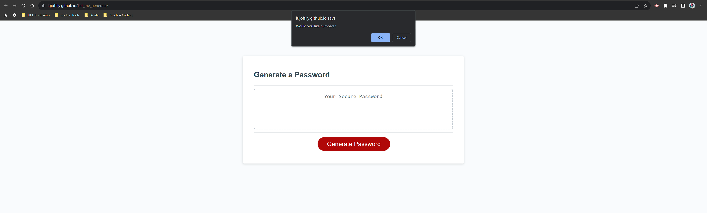
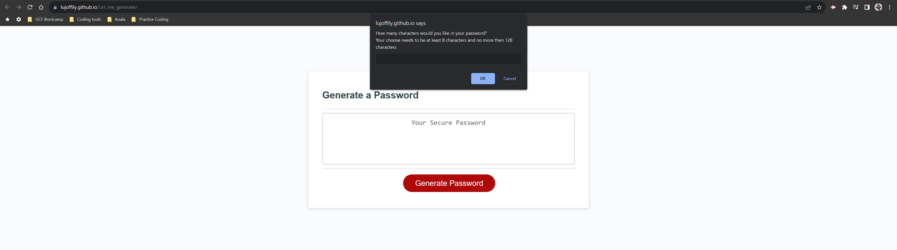
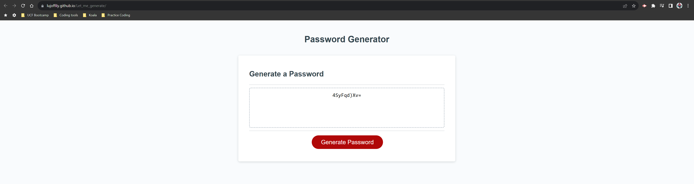

# Let_me_generate

## Description

This webpage was created to generate random passwords for the users and give them a unique password every time. I build this project For users that would like to have there accounts more secured with unique and strong password. 

## Installation

There are no installation needed with this website, every thing you need is located on the website https://lujoffily.github.io/Let_me_generate/.

## Usage

To use this password generator you will first need to access the link https://lujoffily.github.io/Let_me_generate/
When ever you ready to click the Generate Password.

You will be promt to four questions

After answering all the questions the password will be promt on the box in the page. To use the password in a different website just select the whole password and do a control+C and do a control+V on the website you would like to use the password on.

## Credits

As a resource to this password generator I used the mini project on module 3. 

## License

No license was used in this project.
